# 🤖 SeifCLI

<div align="center">


**Your smart terminal assistant — powered by local LLMs, styled with Rich, and able to control your browser like a personal hacker butler** 🕴️

[](https://python.org)
[](https://ollama.ai)
[](https://rich.readthedocs.io)
[](https://selenium.dev)

</div>

---

## 🌟 What is SeifCLI?

SeifCLI is a **proof-of-concept AI-powered command-line assistant** that bridges the gap between natural language and terminal automation. It understands what you want to do in plain English and executes complex web-based tasks automatically.

> 💡 **No API keys needed by default** — runs entirely on your local machine with privacy-first design!

---

## ✨ Features

<table>
<tr>
<td width="50%">

### 🗣️ **Natural Language Interface**
- Speak to your terminal in plain English
- No need to remember complex commands
- Intuitive and conversational experience

### 🏠 **Privacy-First Design**
- Local LLMs via Ollama by default
- No data leaves your machine
- Offline capability built-in

### 🔧 **Multiple LLM Backends**
- 🦙 **Ollama** (recommended)
- 🤖 **OpenAI** (optional)
- 🔗 **llama.cpp** support
- Easy to extend for more providers

</td>
<td width="50%">

### 🌐 **Browser Automation**
- Opens and navigates websites automatically
- Interacts with web elements
- Takes screenshots and extracts data

### 🎨 **Beautiful Terminal UI**
- Rich, colorful output with progress bars
- Formatted text and interactive elements
- Professional-looking terminal experience

### 🔌 **Extensible Plugin System**
- Modular skills architecture
- Easy to add new capabilities
- Community-friendly design

</td>
</tr>
</table>

---

## 🚀 Quick Start

### 📦 Installation

```bash
# 1. Clone the repository
git clone <repository-url>
cd seifcli

# 2. Install Ollama and pull a model
# Visit https://ollama.ai/ for installation instructions
ollama pull mistral

# 3. Install Python dependencies
pip install -r requirements.txt

# 4. Optional: Configure SeifCLI
python -m main setup
```

### 🎯 Usage Examples

<details>
<summary><strong>🔥 Direct Commands</strong></summary>

```bash
# Search and screenshot
python -m main run "Search for AI news on Google and take a screenshot"

# Web scraping
python -m main run "Go to GitHub trending page and extract all repository names"

# Data extraction
python -m main run "Visit weather.com and save today's forecast to a file"
```

</details>

<details>
<summary><strong>💬 Interactive Chat Mode</strong></summary>

```bash
# Start a chat session
python -m main chat

# Chat with memory persistence
python -m main chat --save
python -m main chat --load history_file.json

# Use specific models
python -m main chat --model llama3
```

</details>

---

## 🛠️ Built-in Skills

SeifCLI comes packed with powerful skills right out of the box:

| Skill | Description | Example Usage |
|-------|-------------|---------------|
| 📸 **SCREENSHOT** | Capture web page screenshots | "Take a screenshot of the current page" |
| 📝 **EXTRACT_TEXT** | Extract text using CSS selectors | "Get all paragraph text from this article" |
| 🔗 **EXTRACT_LINKS** | Extract links from web pages | "Find all download links on this page" |
| 💾 **SAVE_TEXT** | Save content to text files | "Save this content to notes.txt" |
| 📂 **LOAD_TEXT** | Load text from files | "Load the content from my notes" |
| 📊 **SAVE_JSON** | Save structured data as JSON | "Save this data as config.json" |
| 📋 **LOAD_JSON** | Load JSON data | "Load settings from config file" |

---

## 🔧 Creating Custom Skills

Extend SeifCLI's capabilities by creating custom skills! It's as simple as adding a Python file:

```python
# seif/skills/my_custom_skill.py
from ..browser import Browser

def analyze_website_performance(browser: Browser, url: str, metrics: str = "basic"):
    """Analyze website performance metrics"""
    
    # Your custom logic here
    browser.get(url)
    # ... performance analysis code ...
    
    return {"performance_score": 95, "load_time": "1.2s"}

SKILLS = {
    "ANALYZE_PERFORMANCE": analyze_website_performance
}
```

Then use it naturally:
```bash
python -m main run "Analyze the performance of example.com"
```

---

## 🏗️ Architecture

<div align="center">

### 🔮 **Intelligent Multi-Layer Architecture**

*SeifCLI employs a sophisticated, event-driven architecture that seamlessly orchestrates AI reasoning, browser automation, and terminal interaction*

```mermaid
graph TB
    subgraph "🧠 Cognitive Layer"
        A[Natural Language Input] --> B[Context Analysis Engine]
        B --> C[Intent Classification]
        C --> D[Task Decomposition]
        D --> E[Action Planning]
    end
    
    subgraph "🔄 Orchestration Layer"
        E --> F[Command Router]
        F --> G{Execution Strategy}
        G -->|Browser Task| H[Web Automation Pipeline]
        G -->|File Operation| I[File System Manager]
        G -->|Data Processing| J[Data Transformation Engine]
        G -->|AI Reasoning| K[LLM Inference Pipeline]
    end
    
    subgraph "🤖 LLM Backend Ecosystem"
        K --> L[Ollama Local Models]
        K --> M[OpenAI API Gateway]
        K --> N[llama.cpp Engine]
        K --> O[Custom Model Adapters]
    end
    
    subgraph "🌐 Browser Automation Suite"
        H --> P[Selenium WebDriver]
        P --> Q[Element Detection]
        P --> R[Action Execution]
        P --> S[Page State Management]
        Q --> T[Smart Waiting Strategies]
        R --> U[Error Recovery System]
    end
    
    subgraph "🎨 Rich Terminal Interface"
        V[Progress Tracking] --> W[Live Status Updates]
        X[Formatted Output] --> W
        Y[Interactive Prompts] --> W
        Z[Error Visualization] --> W
        W --> AA[Beautiful Console Display]
    end
    
    subgraph "🔌 Extensible Skills Framework"
        BB[Core Skills Registry] --> CC[Dynamic Skill Loading]
        DD[Custom Skill Plugins] --> CC
        CC --> EE[Skill Validation]
        EE --> FF[Secure Execution Context]
    end
    
    subgraph "💾 State Management"
        GG[Conversation Memory] --> HH[Session Persistence]
        II[Configuration Store] --> HH
        JJ[Execution History] --> HH
        HH --> KK[Context Restoration]
    end
    
    %% Connections between major subsystems
    I --> V
    J --> X
    S --> Y
    U --> Z
    FF --> F
    KK --> B
    
    %% Styling
    classDef cognitive fill:#e1f5fe,stroke:#0277bd,stroke-width:2px
    classDef orchestration fill:#f3e5f5,stroke:#7b1fa2,stroke-width:2px
    classDef llm fill:#e8f5e8,stroke:#2e7d32,stroke-width:2px
    classDef browser fill:#fff3e0,stroke:#ef6c00,stroke-width:2px
    classDef ui fill:#fce4ec,stroke:#c2185b,stroke-width:2px
    classDef skills fill:#f1f8e9,stroke:#558b2f,stroke-width:2px
    classDef state fill:#f9fbe7,stroke:#827717,stroke-width:2px
    
    class A,B,C,D,E cognitive
    class F,G,H,I,J,K orchestration
    class L,M,N,O llm
    class P,Q,R,S,T,U browser
    class V,W,X,Y,Z,AA ui
    class BB,CC,DD,EE,FF skills
    class GG,HH,II,JJ,KK state
```

</div>



### 🔬 **Core Design Principles**

<table>
<tr>
<td width="33%">

#### 🧠 **AI-First Design**
- **Cognitive processing** at the core
- **Context-aware** decision making
- **Adaptive learning** from interactions
- **Multi-model** inference strategies

</td>
<td width="33%">

#### 🔄 **Event-Driven Architecture**
- **Asynchronous** task execution
- **Reactive** state management
- **Pipeline-based** data flow
- **Fault-tolerant** error handling

</td>
<td width="33%">

#### 🔌 **Extensibility by Design**
- **Plugin architecture** for skills
- **Provider abstraction** for LLMs
- **Modular components** for easy testing
- **Hot-reload** capabilities for development

</td>
</tr>
</table>

### ⚡ **Performance & Scalability**

- **🚀 Lazy Loading**: Skills and models loaded on-demand
- **🔄 Connection Pooling**: Efficient resource management for browser instances
- **📊 Smart Caching**: Intelligent caching of LLM responses and web data
- **⚖️ Load Balancing**: Distribute tasks across multiple LLM backends
- **🔧 Memory Management**: Automatic cleanup and garbage collection
- **📈 Metrics Collection**: Built-in performance monitoring and optimization

---

## 🤝 Contributing

We welcome contributions! SeifCLI is designed to be:
- **Modular**: Easy to add new skills and backends
- **Extensible**: Plugin architecture for community contributions
- **Well-documented**: Clear code and comprehensive docs

---


<div align="center">

**Made with ❤️ by Seif Eddine Mezned**

[⭐ Star this repo](../../stargazers) • [🐛 Report bugs](../../issues) • [💡 Request features](../../issues/new)

</div>
